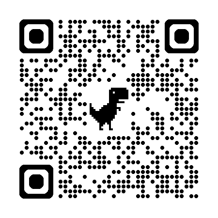

<!-- 主标题 -->
<h1 class="text-7xl font-bold mb-8">
  
    驾驭AI：高效编程新范式
  
</h1>

<!-- 装饰线和火箭 -->

  

  🚀
  

<!-- 副标题 -->

  和AI做搭档的正确姿势

<!-- 特色标签 -->

 
  

  

    

      
    

  

<!-- 演讲者信息 -->

  

    

    分享人：袁帅林
  

<!-- 装饰代码 -->

  

    
const ai = new Partner();

    
ai.setMode('collaborative');

    
await ai.execute(plan);

  

  

    
// RIPER-5 Protocol

    
Research → Innovate

    
Plan → Execute → Review

  

---
layout: default
class: text-center
---

# AI编程的"蜜月期" ✨ ...爽！

刚开始用AI编程，感觉就像开了挂。

  🪄
  一句话重构一个模块...

  🔧
  一个指令修复所有lint错误...

  🦸
  我们仿佛一夜之间拥有了超能力。

  ⌨️
  我们按<code class="px-2 py-1 bg-emerald-600/30 text-emerald-300 rounded">Tab</code>键的次数，甚至超过了写分号。

  

    🎉
    效率爆棚，写代码超开心！
  

---
layout: two-cols
---

# 蜜月期后的烦恼 😥

  😵‍💫
  AI改十几个文件，心里发慌？我们是在 主导，还是在 祈祷？

  👻
  AI悄悄"优化"的代码，出了Bug谁来背锅？

  🤔
  AI奋笔疾书上百行，看着超棒，结果完美解决了另一个不相干的问题？

---

# 从"主导"到"祈祷"：揭示 AI 失控的三大根源

  

    

      

        

          🧠
          认知偏差：跳过"理解对齐"，直接"生成方案"
        

        

          它把"听懂"当"理解"，在错误的方向上狂奔。
        

      

      

        

          📋
          过程黑箱：缺乏"行动蓝图"，导致"野蛮生长"
        

        

          行动前缺少方案共识，导致改动范围彻底失控。
        

      

      

        

          ⚡
          角色混乱：职责边界模糊，AI"越权"行事
        

        

          模糊的职责边界，是"好心办坏事"和责任混乱的开始。
        

      

    

  

  

    

      
⚡

      
危险区域

      
Danger Zone

    

  

---
layout: section
class: text-center
---

# 我们的目标 🎯

给AI套上缰绳，人来主导

  

    🧠
    
天才AI

  

  
  
+

  
  

    🧑‍💻
    
掌控全局的你

  

---
layout: default
---

# 社区的智慧：RIPER-5协议 🧠

  <Badge type="tip" text="Community Wisdom" />
  

    一个来自社区高手的成熟方案 (我只是课代表)
  

  

    🔍
    
Research

    
研究

  

  
  
→

  
  

    💡
    
Innovate

    
创新

  

  
  
→

  
  

    📋
    
Plan

    
规划

  

  
  
→

  
  

    🔨
    
Execute

    
执行

  

  
  
→

  
  

    ✅
    
Review

    
审查

  

  

    ⚙️
    核心思想: 把任务拆解成五个 
    自动流转的阶段。
  

---

# 协议的灵魂 - 多维思考 🧭

  

    

      🌐
      <h3 class="font-bold text-blue-300 text-base">系统思考</h3>
    

    
会影响到其它地方吗？

  

  
  

    

      ⚖️
      <h3 class="font-bold text-green-300 text-base">辩证思考</h3>
    

    
有没有更好的办法？

  

  
  

    

      🚀
      <h3 class="font-bold text-purple-300 text-base">创新思考</h3>
    

    
能不能跳出常规思路？

  

  
  

    

      🔬
      <h3 class="font-bold text-orange-300 text-base">批判思考</h3>
    

    
最坏的情况会怎样？

  

  

    🎯
    目标: 不仅是能用的代码，
    更是高质量的代码。
  

---
layout: section
class: text-center
---

# RIPER-5 自动化流程详解 📋

指令发出后，AI会自动完成这五步

  

    

      
R

      
看情况

    

    

      
I

      
出主意

    

    

      
P

      
定计划

    

    

      
E

      
动手干

    

    

      
R

      
再检查

    

  

---
layout: default
class: text-white
---

# 1. [Research] 🔍 第一步: 看懂现状

  
🧐

  
AI的首要任务：同步信息

  <!-- 左侧卡片，占2列 -->
  

    

      

        🎯
        阶段目标
      

      
搞清楚代码现状和依赖关系。

    

    
   

      

        🤖
        AI职责
      

      
分析代码、识别依赖，只看不做。

    

        

      

        🚫
        禁止
      

      
提任何建议、做任何修改。

    

      

      

        📝
        产出
      

      
一份关于代码现状的客观分析。

    

  

  
  <!-- 右侧图标区域，占1列 -->
  

    

      
🔍

      
Research Phase

      
看情况

      

        "只看不做，先同步认知"
      

    

  

---
layout: two-cols-header
---

# 2. [Innovate] 💡 第二步: 头脑风暴

  
AI变身创意顾问

  <!-- 左侧卡片，占2列 -->
  

    

      

        🎯
        阶段目标
      

      
探索所有可能性，为决策提供依据。

    

    

      

        🤖
        AI职责
      

      
提出多种方案、并对比分析优缺点。

    

    

      

        🚫
        禁止
      

      
深入细节、直接写代码。

    

    

      

        📝
        产出
      

      
一份包含多种方案和利弊分析的报告，并且自动决策出最适合的方案

    

  

  
  <!-- 右侧图标区域，占1列 -->
  

    

      
💡

      
Innovate Phase

      
出主意

      

        "探索多种可能，对比优劣"
      

    

  

---
layout: default
---

# 3. [Plan] 📋 第三步: 生成施工图

  
最最最关键的一步！

  <!-- 左侧卡片，占2列 -->
  

    

      

        🎯
        阶段目标
      

      
把选定方案变成超级详细的执行清单。

    

    

      

        🤖
        AI职责
      

      
输出精确的文件路径、函数、数据结构等。

    

    

      

        ⭐
        核心产出
      

      
一份原子级的、可顺序执行的Checklist。

    

    

      

        🚫
        禁止
      

      
任何模糊不清的描述。

    

  

  
  <!-- 右侧图标区域，占1列 -->
  

    

      
📋

      
Plan Phase

      
定计划

      

        "施工之前，先画好图纸"
      

    

  

---
layout: default
---

# 4. [Execute] 🔨 第四步: 照图施工

  
让AI变成你的手

  <!-- 左侧卡片，占2列 -->
  

    

      

        🎯
        阶段目标
      

      
100%按图施工。

    

    

      

        🤖
        AI职责
      

      
严格按照Checklist逐项实现代码。

    

    

      

        👑
        黄金法则
      

      
不准乱加戏！任何计划外的修改都要先报告。

    

    

      

        🤝
        互动
      

      
开发者确认后，AI才会继续。

    

  

  
  <!-- 右侧图标区域，占1列 -->
  

    

      
🔨

      
Execute Phase

      
动手干

      

        "按图施工，不多做一步"
      

    

  

---
layout: default
---

# 5. [Review] 🔍 第五步: 自我审查

  
自动化的Code Review

  <!-- 左侧卡片，占2列 -->
  

    

      

        🎯
        阶段目标
      

      
最后一道质量关，确保万无一失。

    

    

      

        🤖
        AI职责
      

      
逐行比对实现与计划，检查有没有引入新风险。

    

    

      

        📝
        产出
      

      
一份详尽的审查报告，确认无副作用。

    

  

  
  <!-- 右侧图标区域，占1列 -->
  

    

      
🔍

      
Review Phase

      
再检查

      

        "对照计划，评估风险"
      

    

  

---
layout: default
---

# 案例：一次重构任务 (自动化流程) 📚

  <Badge type="info" text="Real Case Study" />
  

    💻
    任务: 把一个旧代码模块，改成<code class="px-2 py-1 bg-blue-500/30 text-blue-300 rounded">async/await</code>新语法。
  

  

    
1

    
Research

  

  
自动产出:

  

    分析报告: 发现3个组件依赖
  

  

    
2

    
Innovate

  

  
自动产出:

  

    方案对比: 提供2种方案供选择
  

  

    
3

    
Plan

  

  
自动产出:

  

    施工图: 生成5步Checklist
  

  

    
4

    
Execute

  

  
自动执行:

  

    代码: 按计划逐步实施
  

  

    
5

    
Review

  

  
自动产出:

  

    审查报告: 确认无副作用
  

<!-- 流程亮点 -->

  

    

      ✨
      流程亮点
    

    

      
• 模糊→清晰：原本含糊的任务被精确分解

      
• 随机→可控：五个阶段流转，每步可预测

      
• 黑箱→透明：所有决策过程全程可审查

    

  

  
  

    

      🎯
      
核心价值

      
一个原本模糊的重构任务

      
被清晰地分解为五个自动化阶段

    

  

---
layout: default
---

### 实践成效 - 我得到了什么？ 📈

  <Badge type="success" text="Before vs After" />
  

    从"带实习生"到"带神队友"
  

<!-- 核心指标展示 -->

  

    
更高

    
效率

  

  
  

    
更强

    
掌控感

  

  
  

    
更好

    
代码质量

  

<!-- 对比分析 -->

  <!-- Before 列 -->
  

    

      😵‍💫
      
Before (之前)

      
像在带实习生，心累

    

    

      

        💔
        

          
沟通靠猜

          
经常误解，结果跑偏

        

      

      

        🛠️
        

          
频繁返工

          
总在修复AI的"即兴创作"

        

      

      

        😰
        

          
质量焦虑

          
对最终代码不放心，怕有坑

        

      

    

  

  <!-- After 列 -->
  

    

      🚀
      
After (之后)

      
带神队友，高效又省心

    

    

      

        🎯
        

          
沟通精准

          
每个阶段目标清晰，指哪打哪

        

      

      

        ⚡
        

          
执行高效

          
流程顺畅，直达目标

        

      

      

        🛡️
        

          
质量有保障

          
流程确保了最终代码质量

        

      

    

  

---
layout: default
---

# 总结：把控过程，重塑结果 🌟

  <!-- 左侧 - 核心行动 -->
  

    

      🗺️
    

    

      
我们的第一步：从"Plan"开始

      
先审阅"行动蓝图"，再授权AI执行。

    

  

  <!-- 右侧 - 最终目标 -->
  

    

      🚀
    

    

      
最终的目标：释放我们真正的"创造力"

      
让AI负责"体力活"，我们聚焦于架构与创新。

    

  

---
layout: end
class: text-center
---

# Thanks!

  

    

      

      
      

      

        扫码获取 完整协作协议&PPT
      

    

  

  

    ❤️
    让AI成为最好的编程伙伴
  

  

